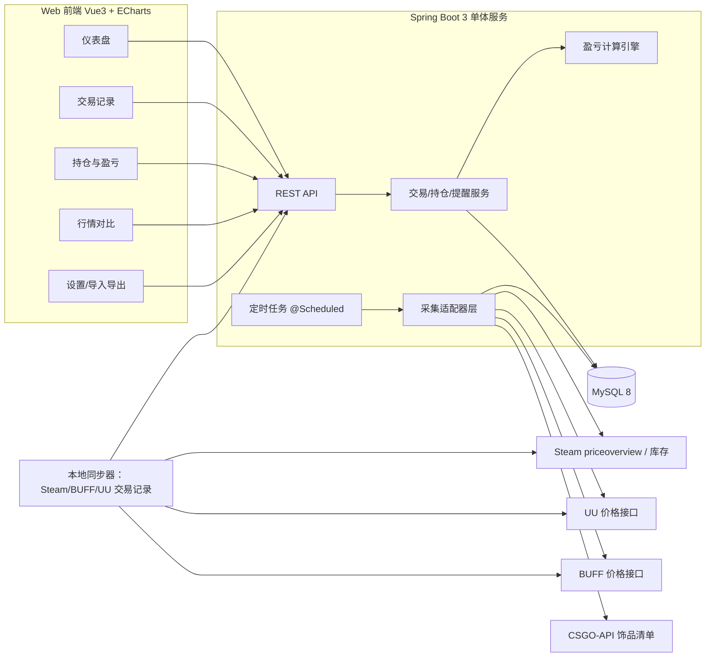

# CS 饰品买卖统计系统 设计文档

- 日期：2026-08-07
- 状态：草案，待用户审阅
- 对应流程：superpowers brainstorming → writing-plans

## 版本记录

- v1（2026-08-07）：初始方案，Python 后端 + SQLite。
- v2（2026-08-07）：按用户要求改为 **Java 后端 + MySQL**；前端与整体架构保持不变。

## 1. 背景与目标

做一个自用的 CS 饰品买卖统计系统：记录买入/卖出，计算盈亏，并获取 UU（悠悠有品）等平台的市场价，用于辅助交易决策。

用户已确认的四项关键决策：

1. 先本地使用，后续可能多人部署访问。
2. 交易记录同时支持手动录入和 Steam / BUFF / UU 自动同步。
3. 统计自己的买卖盈亏，并能获取 UU 市场价。
4. 形态为 Web 页面。

## 2. 需求范围

### 2.1 功能需求（P0 为 MVP 必须，P1 为第二阶段，P2 可选）

| 编号 | 优先级 | 需求 |
|---|---|---|
| F1 | P0 | 手动录入交易记录：饰品、平台、买卖方向、数量、单价、手续费、币种、日期、备注 |
| F2 | P0 | 交易记录增删改查、按时间/平台/类别/饰品筛选 |
| F3 | P0 | 盈亏统计：已实现盈亏、未实现盈亏、ROI，按天/周/月/年/类别/单品聚合 |
| F4 | P0 | 持仓管理：当前持仓、平均成本、当前市值（UU / Steam 价格） |
| F5 | P0 | CSV / JSON / Excel 导入导出交易记录 |
| F6 | P1 | Steam 市场价定时采集与历史价格曲线 |
| F7 | P1 | UU 市场价采集与 Steam 价格对比 |
| F8 | P1 | Steam / BUFF / UU 交易记录自动同步（本地采集器，凭据仅存本机） |
| F9 | P1 | 价格阈值提醒（低于/高于） |
| F10 | P2 | 多用户（登录、数据隔离、MySQL 部署） |
| F11 | P2 | BUFF 价格采集、挂刀比例对比 |
| F12 | P2 | AI 价格预测（占位，不做承诺） |

### 2.2 非功能需求

- 数据为本：所有交易数据存本地 MySQL，可随时导出备份。
- 限流友好：对 Steam / BUFF / UU 的请求必须有节流、重试、退避，避免封禁。
- 隐私：平台登录凭据（Cookie）只允许保存在本机，不进入数据库，不上传服务器。
- 可演进：数据模型预留 user_id，可平滑升级到多用户。
- 环境约束：不向 C 盘系统目录安装任何东西；项目文件、node_modules、数据库文件全部放项目目录内（工具链已在 D 盘就绪）。

## 3. 总体架构

关键架构决策：

- **采集层与账本服务分离**：价格采集是后台任务；交易同步由"本地同步器"完成（见 §10），服务器不接触平台凭据。
- **适配器模式**：每个数据源（Steam/UU/BUFF）是一个独立 adapter，统一输出内部数据结构，接口变动只改对应 adapter。
- **单服务部署**：MVP 用 Spring Boot 单体 + 本地 MySQL；多人版同一套代码 + Docker Compose 部署。

## 4. 技术选型

| 层 | 选型 | 理由 |
|---|---|---|
| 后端 | Java 21 + Spring Boot 3 + Spring Web + Spring Data JPA + Spring Validation | 用户指定 Java；Spring Boot 3 为当前主流 |
| 构建 | Maven（本机已装，D:\Java\apache-maven） | 标准构建工具 |
| 数据库 | MySQL 8.4（本机已装并运行） | 用户指定 |
| 数据库迁移 | Flyway | schema 版本化管理，多人版可直接复用 |
| 定时任务 | Spring `@Scheduled` | 内嵌进应用进程，够用 |
| HTTP 客户端 | Spring RestClient + 重试/退避 | 同步简单，适配器层隔离外部接口 |
| 前端 | Vue 3 + Vite + TypeScript + Pinia + ECharts | 本机已有 Node 22；ECharts 满足行情/盈亏图表 |
| 导入导出 | Apache POI（Excel）+ Jackson（JSON）+ Commons CSV | Java 标准方案 |
| 测试 | JUnit 5 + Mockito + Spring Boot Test（H2 MySQL 兼容模式跑单测，真实 MySQL 做集成验证） | TDD 用 |
| 部署（多人版） | Docker Compose（可选） | 后端 + MySQL 两个服务 |

### 4.1 本机环境现状（已核实，2026-08-07）

- JDK 21（Temurin 21.0.12 LTS）：`D:\Java\jdk-21`。
- Maven：`D:\Java\apache-maven`（本地仓库 `D:\m2repo`）。
- MySQL 8.4.11（Community Server）：`D:\mysql\mysql-8.4.11-winx64`，服务运行中，端口 3306。
- 注意：系统 `JAVA_HOME` / PATH 目前指向 JDK 8（`C:\Program Files\Java\jdk1.8.0_202`），构建与运行脚本必须显式使用 `D:\Java\jdk-21`，避免误用旧版本。
- Windows 下 npm 需用 `npm.cmd` 调用（当前 PowerShell 执行策略禁止 `npm.ps1`）。

## 5. 数据模型（草案）

核心表：

MySQL 通用约定：utf8mb4 字符集、InnoDB 引擎、主键 `BIGINT AUTO_INCREMENT`、金额用 `DECIMAL(18,4)`（展示时四舍五入）、时间用 `DATETIME(3)`、`settings.value` 用 `JSON` 类型；schema 由 Flyway 迁移脚本管理。

**users**（F10 预留；单机版默认一个本地用户）
- id, username, password_hash, created_at

**items**：饰品主数据
- id, market_hash_name（Steam 名，唯一）, category（knife/glove/rifle/pistol/sticker/case/...）, exterior（磨损档位）, stat_trak（bool）, icon_url, source（初始化来源）
- 初始化数据来自 CSGO-API 清单（F6 前置），支持手工补充

**platform_item_links**：跨平台物品 ID 映射（参考 SteamTradingSiteTracker 的 ID Mapper）
- id, item_id, platform（steam/uu/buff）, platform_item_id, extra（如 UU 模板 id）
- 索引：(platform, platform_item_id) 唯一

**trades**：交易分笔账本（核心）
- id, user_id, item_id, platform, direction（buy/sell）, quantity, unit_price, total_amount, fee, fee_rate, currency, traded_at, external_trade_id（平台原始单号，唯一去重）, status（completed/pending）, note, created_at
- 手续费按发生时点的费率落库，避免平台改费率后历史失真
- 索引：(user_id, traded_at)、(platform, external_trade_id) 唯一

**price_snapshots**：价格快照
- id, item_id, platform, price, buy_price（买一，可选）, sell_price（卖一，可选）, volume（可选）, currency, fetched_at
- 索引：(item_id, platform, fetched_at)

**alerts**：价格提醒
- id, user_id, item_id, platform, condition（above/below）, threshold, enabled, triggered_at

**sync_logs**：同步任务日志
- id, user_id, platform, kind（prices/trades）, started_at, finished_at, status, records_added, message

**settings**：用户配置（费率、币种、汇率、采集间隔）
- id, user_id, key, value（JSON）

## 6. 数据源与采集适配器

所有对外接口路径以开发期实际抓包/验证为准，不预先编造。各 adapter 职责：

| 数据源 | 用途 | 已知事实 | 开发期必须验证 |
|---|---|---|---|
| Steam `priceoverview` | 市场价 | 公开接口，无需登录，限流较严 | 当前限流阈值；参数 currency 映射 |
| Steam 库存接口 | 初始持仓盘点 | 公开 profile 可用 `steamcommunity.com/inventory/{steamid}/730/2` | SteamID 解析；私密库存不可用 |
| Steam 交易/市场历史 | 交易记录同步 | 需要登录态，无公开 API | 页面结构与导出方式（本机同步器实现） |
| UU 价格 | 市场价（用户点名要求） | 网页端存在社区使用的 JSON 接口（api.youpin898.com 域） | 具体路径、参数、反爬策略（浏览器抓包确认） |
| BUFF 价格/交易 | 比价与同步（F8/F11） | 社区项目普遍使用 `buff.163.com/api/market/...`，需 `session` Cookie | 接口路径、限流、封号风险 |
| CSGO-API | 饰品主数据 | 公开 JSON，覆盖 CS2 全部饰品，社区广泛使用 | 数据许可条款；是否定期更新 |

采集策略：

- 价格采集按"持仓 + 关注列表"为优先队列，全量清单为低优先级。
- 每次请求间隔 ≥ 1 秒（Steam 更保守），失败指数退避，连续失败熔断并记入 sync_logs。
- 价格快照只增不改，历史曲线由快照聚合。

## 7. 盈亏计算模型

以**移动平均成本法**为默认（后续可加 FIFO 选项）：

- 买入：`cost_basis += quantity * unit_price + fee`
- 卖出：`sell_net = quantity * unit_price - fee`
  - `realized_pnl += sell_net - quantity * avg_cost`
  - 仓位数量与成本同步扣减
- 未实现：`unrealized_pnl = remaining_qty * current_price - remaining_cost`（不含未来卖出费用）
- `ROI = pnl / cost_basis`
- 聚合：按时间（天/周/月/年）、平台、类别、单品分组求和。
- 币种：每笔交易记录自己的 currency；展示时按 settings 里的基准币种换算（汇率可手动维护，F10 后再考虑自动汇率）。

费率（默认值，均做成配置项，开发期以平台页面核实）：

- Steam 卖方费率约 15%
- BUFF 约 2.5%
- UU 以平台实际为准

## 8. API 草案

### 交易

- `GET /api/trades`（筛选：时间、平台、方向、category、item）
- `POST /api/trades`（手动录入）
- `PUT /api/trades/{id}`、`DELETE /api/trades/{id}`
- `POST /api/trades/import`（CSV/JSON/Excel）
- `POST /api/trades/sync` `{platform}`（触发同步器）

### 物品与行情

- `GET /api/items/search?q=`（本地 + CSGO-API 缓存）
- `GET /api/items/{id}`
- `GET /api/prices/latest?item_id=&platform=`
- `GET /api/prices/history?item_id=&platform=&from=&to=`

### 统计

- `GET /api/analytics/pnl?group_by=day|week|month|year|platform|category|item`
- `GET /api/analytics/portfolio`（持仓、平均成本、现价、未实现盈亏）

### 其他

- `GET /api/alerts`、`POST /api/alerts`、`PUT /api/alerts/{id}`、`DELETE /api/alerts/{id}`
- `GET /api/sync/status`、`GET /api/sync/logs`
- `GET/PUT /api/settings`
- 多人版：`POST /api/auth/register|login`，JWT，所有数据接口按 user_id 隔离

## 9. 前端页面

1. **仪表盘**：总市值、已实现/未实现盈亏、ROI、近期交易、持仓 TOP。
2. **交易记录**：表格 + 筛选 + 新建/编辑/删除 + 导入导出 + 各平台"同步"按钮。
3. **持仓**：持仓明细，平均成本，Steam/UU 现价，浮动盈亏。
4. **行情**：单品价格历史曲线，Steam 与 UU 对比。
5. **统计**：ECharts 盈亏趋势、分类占比、胜率。
6. **提醒**：阈值列表。
7. **设置**：平台费率、基准币种、采集间隔、凭据文件状态、备份。

## 10. 同步与凭据安全（关键设计）

Steam / BUFF / UU 的交易历史均需登录态，且无官方公开 API。设计原则：**凭据不出本机**。

- **单机版（第一阶段）**：同步器与后端同机运行。用户在本机配置文件（如 `.secrets/local_cookies.json`，加入 .gitignore）中放入平台会话 Cookie；同步器用该凭据抓取交易记录，规范化后写入本地账本。Cookie 文件权限提示用户保护，不进数据库。
- 实现形态：单机版同步器为后端内的一个同步模块（可独立命令行触发），仅在 localhost 模式启用。
- **多人版（后续）**：同步器改为"客户端侧"形态（浏览器扩展或本地小工具），用户在自己的浏览器/机器上完成登录态抓取，只把**规范化后的交易数据**通过 API 提交到服务器。服务器不存储任何平台凭据。
- 所有同步都做 `external_trade_id` 去重，重复同步幂等。
- BUFF/UU 抓取存在账号风险，界面需展示免责提示（F8 为 P1，可后置）。

## 11. 多用户演进路径（F10）

1. 数据模型从第一天带 `user_id`；单机版固定一个本地用户。
2. 升级步骤：加注册/登录/JWT → 数据接口按 user_id 过滤 → Docker Compose 部署（Spring Boot + MySQL + 前端静态资源）。
3. 多人版部署：Docker Compose（Spring Boot + MySQL），价格采集任务仍由服务端跑（公开接口），交易同步保持客户端侧。

## 12. 测试策略

- 盈亏计算引擎：纯 Java 方法 + 固定样例测试（含手续费、多笔买卖、平仓、汇率换算），JUnit 5 参数化测试。
- API：Spring Boot Test（MockMvc）+ H2 的 MySQL 兼容模式，覆盖 CRUD、导入、同步去重；集成验证用真实本地 MySQL。
- 适配器：mock 外部 HTTP（MockRestServiceServer），不真实请求平台。
- 前端：核心统计计算抽到独立模块，vitest 单测；UI 走手工验收。
- 里程碑完成时跑全量测试，作为"完成"判定标准之一。

## 13. 里程碑

| 阶段 | 内容 | 预估 |
|---|---|---|
| M0 | 脚手架：Spring Boot 骨架 + Flyway 迁移 + MySQL 初始化 + 前端骨架 | 2-3 天 |
| M1 | 手动录入 + 交易 CRUD + 盈亏引擎 + 基础页面（仪表盘/交易/持仓） | 4-5 天 |
| M2 | Steam 价格采集 + 定时任务 + 历史曲线 + 未实现盈亏 | 3-4 天 |
| M3 | UU 价格采集 + Steam/UU 对比 + 物品主数据初始化（CSGO-API） | 3-4 天 |
| M4 | Steam/BUFF/UU 交易同步（本地同步器 + 去重 + 日志） | 4-5 天 |
| M5 | 导入导出、价格提醒、备份、设置页 | 2-3 天 |
| M6（可选） | 多用户 + MySQL 部署（Docker Compose） | 视需要 |

## 14. 风险与合规

- **平台条款与账号风险**：BUFF/UU 的登录态抓取违反平台条款的可能性高，可能封号。功能保留但明确提示，且凭据仅本机。
- **接口变更**：UU/BUFF 无文档接口随时变，靠 adapter 隔离 + 快速修复。
- **Steam 限流**：采集必须保守，避免 IP 被临时限制。
- **费率准确性**：默认值需核实，全部可配置。
- **数据丢失**：MySQL 数据在 D 盘实例内，定期导出备份；导入导出是 P0 功能。
- **工具链**：JDK 21（D:\Java\jdk-21）、Maven（D:\Java\apache-maven）、MySQL 8.4（D:\mysql，服务运行中）已就绪；但 JAVA_HOME/PATH 目前指向 JDK 8，构建与运行脚本必须显式使用 JDK 21。
- **许可**：CSGO-API 等外部数据/代码的许可条款需核实后再用于分发版。

## 15. 开发期必须核实的事项（不做假设）

1. Steam `priceoverview` 当前限流阈值与返回字段。
2. UU 价格接口的准确路径、参数与反爬（浏览器抓包）。
3. BUFF 价格接口与交易历史页面结构。
4. Steam 交易/市场历史页面的结构与本机同步可行性。
5. 三个平台的当前费率。
6. CSGO-API 数据许可与更新频率。
7. MySQL 连接账号/密码（root 或其他账号）、字符集与时区配置（utf8mb4 / Asia/Shanghai）。
8. Maven 首次构建下载依赖的网络可用性；JAVA_HOME 显式指向 D:\Java\jdk-21 的验证。

## 16. 范围外（YAGNI）

- 不做 AI 价格预测（仅占位）。
- 不做自动交易/挂单机器人。
- 不做 Steam 行情全局爬全量饰品（只爬持仓与关注列表，可按需扩展）。
- 不做移动端 App。
